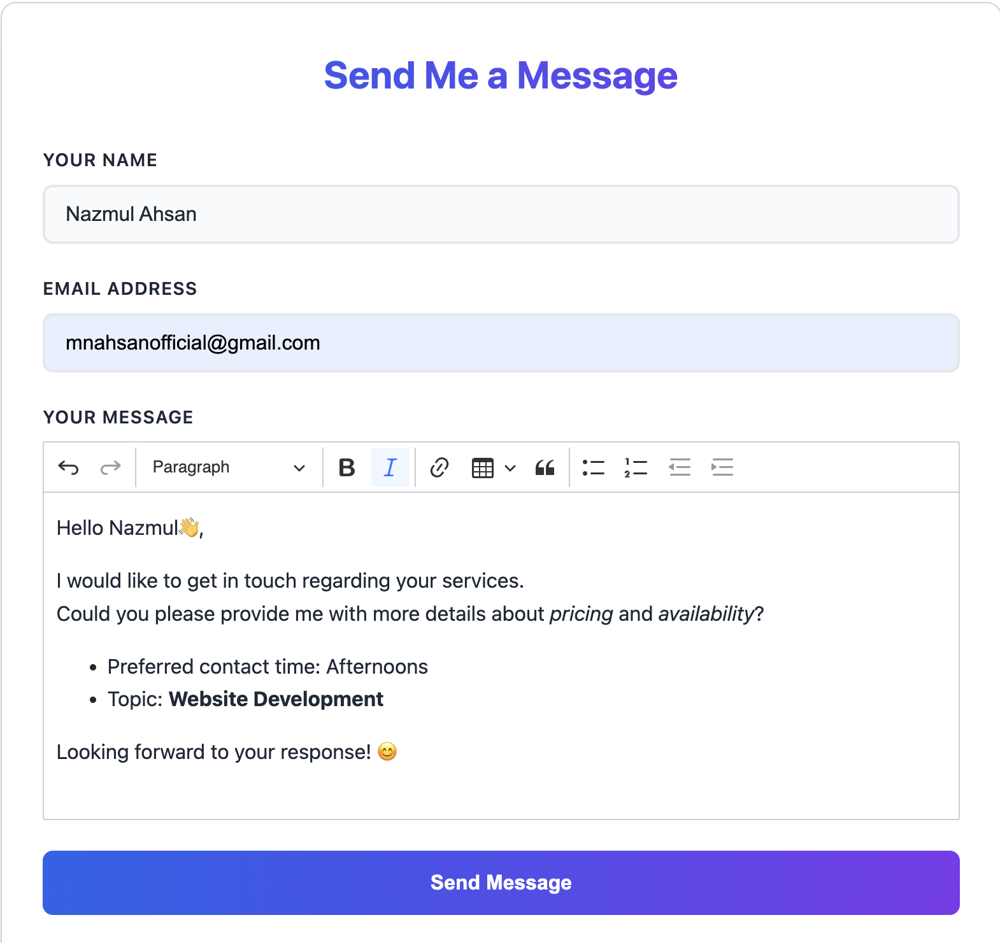

# Website Contact Form

A **framework-agnostic**, **TypeScript** contact form library that any website can embed with a single function call. Features rich text editing with CKEditor 5 and optional email delivery via EmailJS.



*The enhanced contact form with CKEditor 5 rich text editor, featuring comprehensive formatting tools including bold, italic, links, tables, lists, and alignment options.*

## 🌐 Live Demo

**See it in action:** [Live Demo on Portfolio](https://my-portfolio-mnahsanofficials-projects.vercel.app/#contact)

Experience the enhanced CKEditor with all formatting features, responsive design, and EmailJS integration.

## ✨ Features

- 🚀 **Framework-agnostic** - Works with vanilla JS, React, Vue, Angular, or any framework
- 📝 **Rich text editor** - CKEditor 5 Classic integration for formatted messages
- 📧 **EmailJS integration** - Built-in email delivery (optional)
- 🎨 **Modern UI** - Clean, responsive design with light/dark themes
- ♿ **Accessible** - ARIA labels, keyboard navigation, screen reader support
- 🛡️ **Anti-spam** - Honeypot field and rate limiting
- 📱 **Responsive** - Mobile-first design that works on all devices
- 🎯 **TypeScript** - Full type safety and IntelliSense support
- 🌐 **UMD + ESM** - Works with script tags and modern bundlers

## 📈 Version Comparison

| Feature | v1.0.0 | v1.0.1 | v1.0.2 | v1.0.3 | v1.0.4 | v1.1.0 | Status |
|---------|---------|---------|---------|---------|---------|---------|---------|
| **Core Library** | ✅ | ✅ | ✅ | ✅ | ✅ | ✅ | Stable |
| **Enhanced CKEditor** | ✅ | ✅ | ✅ | ✅ | ✅ | ✅ | Enhanced |
| **EmailJS Integration** | ✅ | ✅ | ✅ | ✅ | ✅ | ✅ | Stable |
| **TypeScript Support** | ✅ | ✅ | ✅ | ✅ | ✅ | ✅ | Complete |
| **UMD + ESM Builds** | ✅ | ✅ | ✅ | ✅ | ✅ | ✅ | Optimized |
| **Responsive Design** | ✅ | ✅ | ✅ | ✅ | ✅ | ✅ | Mobile-First |
| **Accessibility** | ✅ | ✅ | ✅ | ✅ | ✅ | ✅ | WCAG Compliant |
| **Anti-Spam Protection** | ✅ | ✅ | ✅ | ✅ | ✅ | ✅ | Production Ready |
| **Documentation** | ✅ | ✅ | ✅ | ✅ | ✅ | ✅ | Comprehensive |
| **CHANGELOG.md** | ❌ | ✅ | ✅ | ✅ | ✅ | ✅ | **NEW** |
| **Contact Form Preview** | ❌ | ✅ | ✅ | ✅ | ✅ | ✅ | **NEW** |
| **Package Optimization** | ✅ | ✅ | ✅ | ✅ | ✅ | ✅ | **IMPROVED** |
| **Version Comparison** | ❌ | ❌ | ✅ | ✅ | ✅ | ✅ | **NEW** |
| **Image Integration** | ❌ | ❌ | ❌ | ✅ | ✅ | ✅ | **NEW** |
| **Package Cleanup** | ❌ | ❌ | ❌ | ❌ | ✅ | ✅ | **NEW** |
| **React Compatibility** | ❌ | ❌ | ❌ | ❌ | ✅ | ✅ | **NEW** |
| **TypeScript Declarations** | ❌ | ❌ | ❌ | ❌ | ✅ | ✅ | **NEW** |
| **Build System Fixes** | ❌ | ❌ | ❌ | ❌ | ✅ | ✅ | **NEW** |
| **React Component Wrapper** | ❌ | ❌ | ❌ | ❌ | ❌ | ✅ | **NEW** |
| **DOM Conflict Resolution** | ❌ | ❌ | ❌ | ❌ | ❌ | ✅ | **NEW** |
| **Major Build Overhaul** | ❌ | ❌ | ❌ | ❌ | ❌ | ✅ | **NEW** |
| **Local Image Assets** | ❌ | ❌ | ✅ | **NEW** |

### 🔄 **What's New in v1.1.0**
- **🚀 React Component Wrapper** - New `ReactContactForm` component for seamless React integration
- **🔧 DOM Conflict Resolution** - Fixed critical React runtime errors and DOM manipulation conflicts
- **📝 TypeScript Declarations** - Complete TypeScript support with proper `.d.ts` files
- **⚙️ Build System Overhaul** - Major Vite configuration improvements for React compatibility
- **📚 Enhanced Documentation** - Comprehensive React usage examples and API reference

### 🔄 **What's New in v1.0.2**
- **🖼️ Local Image Assets** - Contact form preview image included in package
- **📊 Version Comparison** - Comprehensive feature comparison table
- **📋 VERSION_COMPARISON.md** - Detailed analysis of all versions
- **📦 Enhanced Package** - Assets directory included for better organization

### 🔄 **What's New in v1.0.1**
- **📝 CHANGELOG.md** - Complete feature documentation and version history
- **🖼️ Contact Form Preview** - Professional screenshot showcasing all features
- **📦 Package Enhancement** - Better file organization and documentation inclusion
- **🔗 Link Updates** - Live demo and company information properly linked

## 🚀 Quick Start

### Installation

```bash
npm install website-contact-form @ckeditor/ckeditor5-build-classic emailjs-com
```

### Basic Usage (Script Tag)

```html
<!DOCTYPE html>
<html>
<head>
    <link rel="stylesheet" href="./node_modules/website-contact-form/dist/style.css">
</head>
<body>
    <div id="contact"></div>
    
    <!-- Load dependencies -->
    <script src="https://cdn.ckeditor.com/ckeditor5/40.0.0/classic/ckeditor.js"></script>
    <script src="https://cdn.jsdelivr.net/npm/emailjs-com@3.2.0/dist/email.min.js"></script>
    
    <!-- Load our library -->
    <script src="./node_modules/website-contact-form/dist/index.umd.js"></script>
    
    <script>
        WebsiteContactForm.createContactForm({
            target: '#contact',
            theme: 'light',
            labels: { title: 'Send Me a Message' },
            buttonText: 'Send Message'
        });
    </script>
</body>
</html>
```

### ESM Usage (Bundler)

```typescript
import { createContactForm } from 'website-contact-form';
import 'website-contact-form/dist/style.css';

const form = await createContactForm({
    target: document.getElementById('contact')!,
    theme: 'dark',
    labels: { title: 'Get in Touch' },
    placeholders: {
        name: 'Your Name',
        email: 'your@email.com',
        message: 'Tell us about your project...'
    }
});

// Later, cleanup
form.destroy();
```

### React Usage

```tsx
import React from 'react';
import { ReactContactForm } from 'website-contact-form';
import 'website-contact-form/dist/style.css';

const ContactPage: React.FC = () => {
  return (
    <div>
      <h1>Contact Us</h1>
      <ReactContactForm
        theme="light"
        labels={{
          title: "Send Us a Message",
          name: "Your Name",
          email: "Email Address",
          message: "Your Message"
        }}
        buttonText="Send Message"
        onSubmit={(data) => {
          console.log('Form submitted:', data);
        }}
      />
    </div>
  );
};
```

**Note**: For React usage, make sure to install React as a peer dependency:
```bash
npm install react react-dom
```

## 📚 API Reference

### `createContactForm(options)`

Creates and mounts a contact form, returning a destroyable handle.

### `ReactContactForm` (React Component)

A React component wrapper that handles lifecycle management automatically.

```tsx
<ReactContactForm
  theme="light"
  labels={{ title: "Contact Us" }}
  onSubmit={(data) => console.log(data)}
/>
```

#### Options

| Property | Type | Default | Description |
|----------|------|---------|-------------|
| `target` | `string \| HTMLElement` | **Required** | DOM selector or element to mount into |
| `theme` | `'light' \| 'dark'` | `'light'` | Visual theme |
| `labels` | `Labels` | `{}` | Custom field labels |
| `placeholders` | `Placeholders` | `{}` | Input placeholder text |
| `buttonText` | `string` | `'Send Message'` | Submit button text |
| `emailJS` | `EmailJSConfig` | `undefined` | EmailJS configuration |
| `onSubmit` | `Function` | `undefined` | Callback before submission |
| `onSuccessMessage` | `string` | `'✅ Message sent successfully!'` | Success message |
| `onErrorMessage` | `string` | `'❌ Failed to send. Please try again.'` | Error message |
| `accentGradient` | `string` | `'linear-gradient(90deg, #2563eb, #7c3aed)'` | Button gradient |

#### Labels Interface

```typescript
interface Labels {
  title?: string;    // default: "Send Me a Message"
  name?: string;     // default: "Your Name"
  email?: string;    // default: "Email Address"
  message?: string;  // default: "Your Message"
}
```

#### Placeholders Interface

```typescript
interface Placeholders {
  name?: string;     // default: "Enter your name"
  email?: string;    // default: "Enter your email"
  message?: string;  // default: "Type your message here..."
}
```

#### EmailJS Configuration

```typescript
interface EmailJSConfig {
  serviceId: string;    // Your EmailJS service ID
  templateId: string;   // Your EmailJS template ID
  publicKey: string;    // Your EmailJS public key
}
```

#### Return Value

Returns a `Promise<Destroyable>` where `Destroyable` has:

```typescript
interface Destroyable {
  destroy(): void;  // Unmounts form and cleans up resources
}
```

## 📧 EmailJS Setup

### 1. Create EmailJS Account

1. Go to [EmailJS.com](https://www.emailjs.com/) and sign up
2. Verify your email address

### 2. Create Email Service

1. In EmailJS dashboard, go to "Email Services"
2. Click "Add New Service"
3. Choose your email provider (Gmail, Outlook, etc.)
4. Follow the authentication steps
5. Note your **Service ID**

### 3. Create Email Template

1. Go to "Email Templates"
2. Click "Create New Template"
3. Design your email template
4. Use these variables in your template:
   - `{{from_name}}` - Sender's name
   - `{{from_email}}` - Sender's email
   - `{{message_html}}` - Formatted message (HTML)
   - `{{message_text}}` - Plain text message
5. Note your **Template ID**

### 4. Get Public Key

1. Go to "Account" → "API Keys"
2. Copy your **Public Key**

### 5. Configure in Code

```typescript
const form = await createContactForm({
  target: '#contact',
  emailJS: {
    serviceId: 'gmail',           // Your service ID
    templateId: 'template_abc123', // Your template ID
    publicKey: 'user_xyz789'      // Your public key
  }
});
```

### Environment Variables (Recommended)

```bash
# .env file
EMAILJS_SERVICE_ID=gmail
EMAILJS_TEMPLATE_ID=template_abc123
EMAILJS_PUBLIC_KEY=user_xyz789
```

```typescript
const form = await createContactForm({
  target: '#contact',
  emailJS: {
    serviceId: process.env.EMAILJS_SERVICE_ID!,
    templateId: process.env.EMAILJS_TEMPLATE_ID!,
    publicKey: process.env.EMAILJS_PUBLIC_KEY!
  }
});
```

## 🎨 Theming & Customization

### CSS Variables

The library uses CSS variables for easy theming:

```css
.wcf {
  --bg: #ffffff;                    /* Background color */
  --fg: #1f2937;                    /* Text color */
  --border: #d1d5db;                /* Border color */
  --accentStart: #2563eb;           /* Button gradient start */
  --accentEnd: #7c3aed;             /* Button gradient end */
  --error: #dc2626;                 /* Error color */
  --success: #16a34a;               /* Success color */
}
```

### Custom Theme Override

```css
.wcf--custom {
  --bg: #f8fafc;
  --fg: #0f172a;
  --accentStart: #f59e0b;
  --accentEnd: #dc2626;
}

.wcf--custom .wcf__submit {
  background: linear-gradient(90deg, var(--accentStart), var(--accentEnd));
}
```

### Custom Button Gradient

```typescript
const form = await createContactForm({
  target: '#contact',
  accentGradient: 'linear-gradient(90deg, #f59e0b, #dc2626)'
});
```

## 🔧 Advanced Usage

### Custom Validation

```typescript
const form = await createContactForm({
  target: '#contact',
  onSubmit: async (data) => {
    // Custom validation
    if (data.messageText.length < 50) {
      throw new Error('Message too short');
    }
    
    // Send to your API
    await fetch('/api/contact', {
      method: 'POST',
      body: JSON.stringify(data)
    });
  }
});
```

### Form Lifecycle Management

```typescript
let form: Destroyable;

async function showForm() {
  form = await createContactForm({
    target: '#contact',
    theme: 'light'
  });
}

function hideForm() {
  if (form) {
    form.destroy();
    form = null;
  }
}
```

### Multiple Forms

```typescript
const forms = await Promise.all([
  createContactForm({
    target: '#contact-1',
    theme: 'light',
    labels: { title: 'General Inquiry' }
  }),
  createContactForm({
    target: '#contact-2',
    theme: 'dark',
    labels: { title: 'Support Request' }
  })
]);

// Cleanup all forms
forms.forEach(form => form.destroy());
```

## 🛡️ Security Features

### Anti-Spam Protection

- **Honeypot field** - Hidden field that bots fill out
- **Rate limiting** - Prevents rapid-fire submissions (10-second cooldown)
- **Input validation** - Server-side validation rules

### Validation Rules

- **Name**: Required, minimum 2 characters
- **Email**: Required, RFC-compliant format
- **Message**: Required, content after HTML stripping

## ♿ Accessibility

- **ARIA labels** - Proper form associations
- **Keyboard navigation** - Full keyboard support
- **Screen readers** - Semantic HTML structure
- **High contrast** - CSS media query support
- **Reduced motion** - Respects user preferences

## 📱 Responsive Design

- **Mobile-first** - Optimized for small screens
- **Fluid layout** - Adapts to container width
- **Touch-friendly** - Proper touch target sizes
- **Breakpoints** - Responsive at 768px and 480px

## 🚨 Troubleshooting

### Common Issues

#### CKEditor Not Loading

```bash
# Ensure CKEditor is installed
npm install @ckeditor/ckeditor5-build-classic

# Check CDN URL in HTML
<script src="https://cdn.ckeditor.com/ckeditor5/40.0.0/classic/ckeditor.js"></script>
```

#### EmailJS Errors

1. **Network Error**: Check internet connection
2. **Service Error**: Verify service ID and authentication
3. **Template Error**: Check template ID and variable names
4. **Rate Limit**: Wait 10 seconds between submissions

#### Styling Issues

```css
/* Ensure CSS is loaded */
<link rel="stylesheet" href="./node_modules/website-contact-form/dist/style.css">

/* Check for CSS conflicts */
.wcf { /* Your custom styles */ }
```

#### CSP (Content Security Policy)

Add to your CSP headers:

```
script-src 'self' 'unsafe-inline' https://cdn.ckeditor.com https://cdn.jsdelivr.net;
style-src 'self' 'unsafe-inline';
```

### Debug Mode

```typescript
// Check browser console for detailed error messages
const form = await createContactForm({
  target: '#contact',
  onSubmit: (data) => {
    console.log('Form data:', data);
  }
});
```

## 🏗️ Development

### Build from Source

```bash
# Clone repository
git clone https://github.com/yourusername/website-contact-form.git
cd website-contact-form

# Install dependencies
npm install

# Build library
npm run build

# Development mode
npm run dev

# Type checking
npm run type-check
```

### Project Structure

```
src/
├── index.ts          # Public API exports
├── types.ts          # TypeScript interfaces
├── form.ts           # Main form component
├── editor.ts         # CKEditor wrapper
├── email.ts          # EmailJS integration
├── validation.ts     # Form validation logic
└── styles.css        # Component styles

examples/
├── demo.html         # UMD usage example
└── demo-bundled.ts   # ESM usage example

dist/                 # Built files (generated)
├── index.esm.js      # ESM bundle
├── index.umd.js      # UMD bundle
├── style.css         # Extracted CSS
└── index.d.ts        # TypeScript definitions
```

## 🤝 Contributing

1. Fork the repository
2. Create a feature branch (`git checkout -b feature/amazing-feature`)
3. Commit your changes (`git commit -m 'Add amazing feature'`)
4. Push to the branch (`git push origin feature/amazing-feature`)
5. Open a Pull Request

## 🏢 Company

**TrioTrix Tech Solutions** - Empowering Tomorrow's Digital World

- **Website:** [TrioTrix Tech Solutions](https://www.linkedin.com/company/triotrix-tech-solutions/)
- **Specialties:** Web Development, SQA, Android Development, IT Consulting, Software Development
- **Location:** Dhaka, Bangladesh

## 📄 License

This project is licensed under the MIT License - see the [LICENSE](LICENSE) file for details.

## 🙏 Acknowledgments

- [CKEditor 5](https://ckeditor.com/) - Rich text editing
- [EmailJS](https://www.emailjs.com/) - Email delivery service
- [Vite](https://vitejs.dev/) - Build tooling

## 📞 Support

- 📧 **Email**: nmahsanofficial@gmail.com
- 🐛 **Issues**: [GitHub Issues](https://github.com/mnahsanofficial/website-contact-form/issues)
- 📖 **Documentation**: [GitHub Repository](https://github.com/mnahsanofficial/website-contact-form)
- 💼 **LinkedIn**: [Connect with Author](https://www.linkedin.com/in/mn-ahsan/)
- 🏢 **Company**: [TrioTrix Tech Solutions](https://www.linkedin.com/company/triotrix-tech-solutions/)

---

**Made with ❤️ by [Nazmul Ahsan](https://www.linkedin.com/in/mn-ahsan/) at [TrioTrix Tech Solutions](https://www.linkedin.com/company/triotrix-tech-solutions/)**
# website-contact-form
